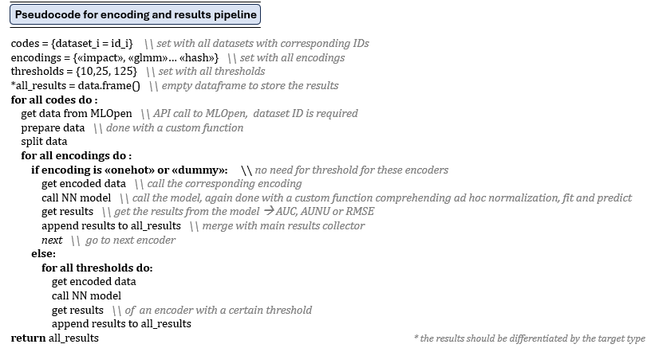

# Feature Engineering in High Cardinality space:   Replicating and Extending a paper by Pargent et al (2021)

## Overview
This project is a statistical analysis endeavor aimed at assessing the reproducibility of the paper titled **"Regularized target encoding outperforms traditional methods in supervised machine learning with high cardinality features"** by Pargent et al, published in 2021. In our exploration, we extended the original work by incorporating a Neural Network model alongside the traditional machine learning algorithms proposed in the paper.

## Objective
The primary goal of this project was to replicate and validate the findings from the paper while also expanding the scope by introducing a Neural Network model. Basically, we focused on the impact of different encodings for categorical variables on the performance of various classification algorithms, which means that the main task revolved around **feature engineering**. Categorical variables often pose a challenge in machine learning models, especially when dealing with high cardinality features. 

## Encoding Techniques Explored
- Frequency Encoding
- One-Hot Encoding
- Integer Encoding
- Dummy Encoding
- Hash Encoding
- Regularized Impact Encoding
- Leaf Encoding
- GLMM Encoding

## Pseudocode 
To better understand our approach, we provide the pseudocode depicted below:

## Repository Structure
Please refer to the "Consegna" folder only 
